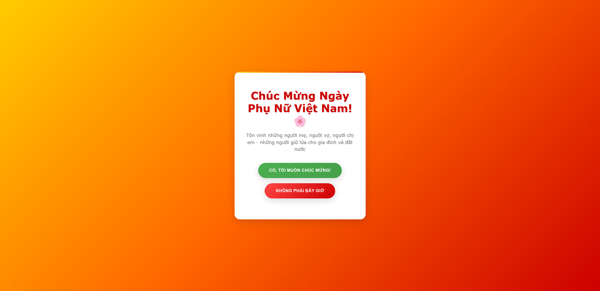

# Women's Day Celebration App 🌸

A beautiful and interactive website celebrating Vietnamese Women's Day (Ngày Phụ Nữ Việt Nam 20/10) with multiple questions, floating flower petals, animated effects, and a playful "No" button that moves away when you try to click it!

## ✨ Features

- **Interactive Quiz**: Multiple questions about Vietnamese Women's Day
- **Question-First Flow**: Educational questions before celebration
- **Interactive Design**: "No" button moves away when hovered over
- **Beautiful Animations**: Floating flower petals and smooth transitions
- **Responsive Layout**: Works perfectly on all devices
- **Celebratory Effects**: Confetti animation and dynamic text changes
- **Vietnamese Women's Day Theme**: Pink gradient background with floral elements

## 📸 Screenshots



## 🎯 Live Demo

Visit the live website: [https://huyl0246.github.io/20-10/](https://huyl0246.github.io/20-10/)

## 🚀 Getting Started

### Prerequisites

- Modern web browser (Chrome, Firefox, Safari, Edge)
- No installation required - runs directly in browser

### Running Locally

1. Clone the repository:
   ```bash
   git clone https://github.com/HuyLo246/20-10.git
   cd 20-10
   ```

2. Open `public/index.html` in your browser (no server needed for local development)

### GitHub Pages Deployment

This project is automatically deployed to GitHub Pages. The website serves the question page first, then leads to the celebration page after completing the quiz.

## 📁 Project Structure

```
women-day/
├── public/
│   ├── index.html          # Main entry point (question page)
│   ├── question.html       # Alternative question page
│   ├── css/
│   │   └── style.css       # All styling
│   ├── js/
│   │   └── app.js          # Main JavaScript functionality
│   └── images/
│       └── 20-10.png       # Preview image
└── README.md
```

## 🌐 Flow

1. **Question Page**: Users answer 3 questions about Vietnamese Women's Day
2. **Main Page**: After completing questions, users see the celebration page
3. **"Yes" Button**: Shows full celebration with animations and effects
4. **"No" Button**: Playfully moves away when clicked

## 🛠️ Technologies Used

- **Frontend**: HTML5, CSS3, JavaScript
- **Deployment**: GitHub Pages (static hosting)

## 📝 License

This project is open source and available under the [MIT License](LICENSE).

## 💝 Support

If you enjoy this project, please consider:
- ⭐ Starring the repository
- 🐛 Reporting issues
- 🚀 Contributing improvements

---

*Made with ❤️ for all amazing women, especially on Vietnamese Women's Day 20/10!* 🌸 Đặc biệt dành tặng các chị em phụ nữ Việt Nam nhân ngày 20/10! 🌸*
